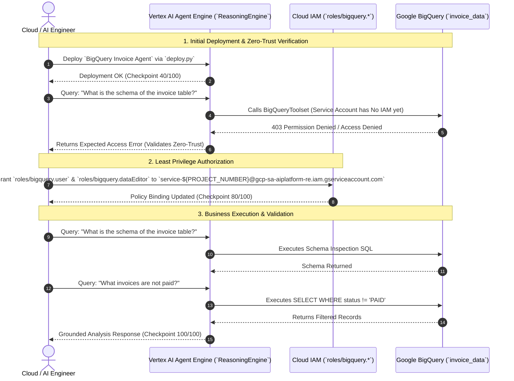

# Govern Agent Access with Gemini Enterprise & Agent Platform: Challenge Lab

[](https://partner.skills.google/course_templates/1749/labs/631982)
[](#)
[](#)
[](https://github.com/google/agent-development-kit)
[](#)

> **Lab Guide Link:** [Govern Agent Access with Gemini Enterprise & Agent Platform: Challenge Lab (Lab 631982)](https://partner.skills.google/course_templates/1749/labs/631982)

---

## 📖 Overview

This repository contains the complete implementation, deployment artifacts, step-by-step CLI runbook, and security architecture for **GENAI160 / Lab ID 631982** (*Govern Agent Access with Gemini Enterprise & Agent Platform: Challenge Lab*).

In this lab, you deploy an enterprise financial analysis agent (**BigQuery Invoice Agent**) to the **Vertex AI Agent Platform (Reasoning Engine / Agent Engine)**, enforce **Zero-Trust IAM boundaries**, test the unprivileged baseline access-denied state, grant least-privilege IAM roles to the dedicated Agent Principal, and execute validated analytical queries against BigQuery billing datasets.

---

## 🏛️ Security & Governance Architecture



---

## 🚀 Fast-Track All-in-One CLI Deployment

To execute the entire lab automatically in Google Cloud Shell:

```bash
# Clone the repository
git clone https://github.com/junyish/genai160-Govern-Agent-Access-with-Gemini-Enterprise-Agent-Platform-Challenge-Lab.git
cd genai160-Govern-Agent-Access-with-Gemini-Enterprise-Agent-Platform-Challenge-Lab

# Run the automated end-to-end execution script
chmod +x streamlined_run_all.sh
./streamlined_run_all.sh
```

---

## 📋 Manual Step-by-Step Command Line Flow

For the complete in-depth guide with code explanations, refer to [**`takeaway-genai160-govern-agent-access-challenge-lab.md`**](takeaway-genai160-govern-agent-access-challenge-lab.md).

### 1. Initialize Environment
```bash
export PROJECT_ID=$(gcloud config get-value project)
export PROJECT_NUMBER=$(gcloud projects describe $PROJECT_ID --format="value(projectNumber)")
export LOCATION="us-central1"
export MODEL="gemini-2.5-flash"
export DISPLAY_NAME="BigQuery Invoice Agent"
export STAGING_BUCKET="gs://${PROJECT_ID}-agent-staging"
export REASONING_ENGINE_SA="service-${PROJECT_NUMBER}@gcp-sa-aiplatform-re.iam.gserviceaccount.com"

# Enable APIs
gcloud services enable aiplatform.googleapis.com bigquery.googleapis.com logging.googleapis.com storage.googleapis.com

# Create staging bucket
gsutil mb -l "${LOCATION}" "${STAGING_BUCKET}" || true
```

### 2. Deploy Agent to Agent Runtime (Checkpoint: 40/100)
```bash
pip install -r requirements.txt
python3 deploy.py
```

### 3. Grant IAM Permissions (Checkpoint: 80/100)
```bash
gcloud projects add-iam-policy-binding "$PROJECT_ID" \
    --member="serviceAccount:${REASONING_ENGINE_SA}" \
    --role="roles/bigquery.user"

gcloud projects add-iam-policy-binding "$PROJECT_ID" \
    --member="serviceAccount:${REASONING_ENGINE_SA}" \
    --role="roles/bigquery.dataEditor"
```

### 4. Run Business Validation Queries (Checkpoint: 100/100)
```bash
python3 test_agent.py
```

---

## 📁 Repository Structure

```
genai160-Govern-Agent-Access-with-Gemini-Enterprise-Agent-Platform-Challenge-Lab/
├── README.md                                             # Project overview & quickstart
├── takeaway-genai160-govern-agent-access-challenge-lab.md # Deep step-by-step CLI & engineering guide
├── streamlined_run_all.sh                                # Automated all-in-one execution script
├── deploy.py                                             # Vertex AI Reasoning Engine deployment script
├── test_agent.py                                         # Multi-query validation test script
├── requirements.txt                                      # Root Python dependencies
└── invoice_agent/
    ├── __init__.py                                       # Package initializer
    ├── agent.py                                          # Core ADK BigQuery agent definition
    ├── callback_logging.py                               # Cloud Logging telemetry hooks
    ├── requirements.txt                                  # Agent runtime requirements
    └── .env.example                                      # Environment variable template
```

---

## 📚 Key References & Documentation
* [Google Cloud Skills Boost: Challenge Lab 631982](https://partner.skills.google/course_templates/1749/labs/631982)
* [Vertex AI Agent Engine Documentation](https://cloud.google.com/vertex-ai/docs/reasoning-engine/overview)
* [Google Agent Development Kit (ADK) GitHub](https://github.com/google/agent-development-kit)
