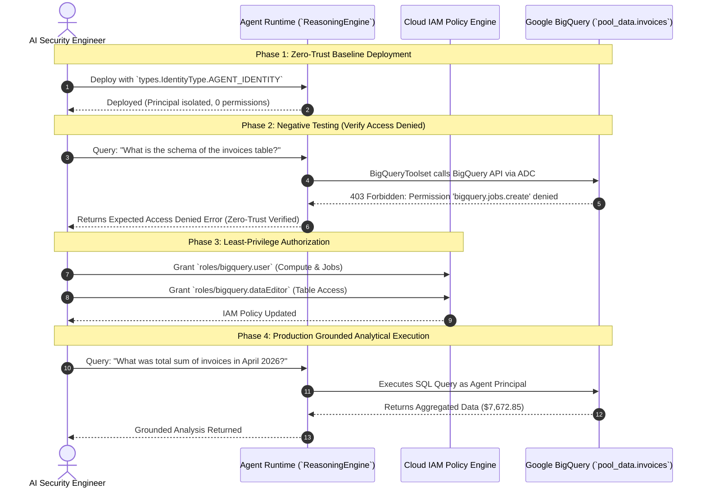

# Architectural Learning Takeaways: Govern Agent Access with Gemini Enterprise & Agent Platform

> **Challenge Lab Reference:** `GENAI160 / Lab ID 631982 / Course Template 1749`  
> **Lab Guide Link:** [Govern Agent Access with Gemini Enterprise & Agent Platform: Challenge Lab (Lab 631982)](https://partner.skills.google/course_templates/1749/labs/631982)  
> **For the Step-by-Step CLI Runbook, see:** [**`step-by-step-instruction-guide.md`**](step-by-step-instruction-guide.md)

---

## 1. Executive Summary & Core Architectural Paradigm

In production enterprise environments, granting generative AI agents unrestricted cloud access poses severe data exfiltration, unauthorized modification, and compliance risks. 

The **GENAI160 Challenge Lab** demonstrates how to apply **Zero-Trust Security** to autonomous AI agents running on the **Vertex AI Agent Platform (Agent Engines / Reasoning Engine)** using the **Google Agent Development Kit (ADK)** and BigQuery data governance.

```
+-----------------------------------------------------------------------------------------------+
|                                    ENTERPRISE ZERO-TRUST                                      |
|                                                                                               |
|   +--------------------------+                         +----------------------------------+   |
|   |   Agent Runtime          |                         |   Target Google Cloud Resource   |   |
|   |   (Reasoning Engine)     |                         |   (BigQuery `pool_data.invoices`)|   |
|   |                          |   1. Deploy (0 Perms)   |                                  |   |
|   |   Identity:              | ----------------------> |   Status: Access Denied (403)    |   |
|   |   AGENT_IDENTITY         |                         |                                  |   |
|   |   (SPIFFE Principal)     |   2. Explicit IAM Grant |                                  |   |
|   |                          | ----------------------> |   Status: Authorized Query       |   |
|   |                          |   - roles/bigquery.user |                                  |   |
|   |                          |   - roles/bigquery.data |                                  |   |
|   +--------------------------+                         +----------------------------------+   |
+-----------------------------------------------------------------------------------------------+
```

---

## 2. Agent Identity (`AGENT_IDENTITY`) vs. Traditional Auth Models

| Security Dimension | Traditional Shared Service Account | User-Delegated 3-Legged OAuth | Isolated Agent Identity (`AGENT_IDENTITY`) |
| :--- | :--- | :--- | :--- |
| **Identity Entity** | Shared GCP Service Account (`*.iam.gserviceaccount.com`) | End-User Google Account via Refresh Token | Dedicated Cryptographic Runtime Principal |
| **Trust Model** | Ambient Project Trust (Broad Privileges) | Scoped to individual end-user permissions | **Zero-Trust (Denied by Default)** |
| **Initial Privileges** | Inherits whatever project SA has | Whatever user has on GCP | **0 Permissions on deployment** |
| **Blast Radius** | High (if compromised, all services sharing SA exposed) | Scoped to individual user | **Minimal (Isolated to single agent workload)** |
| **Auditability** | Difficult to distinguish agent actions from backend jobs | Audited as the user | Dedicated Cloud Logging / Audit Trails |
| **Best Used For** | Legacy batch jobs & background workers | Interactive Gemini Enterprise extensions | **Autonomous Enterprise Agents on Agent Platform** |

---

## 3. The 4-Phase Governance Lifecycle



---

## 4. BigQuery Toolset & ADC Propagation Deep-Dive

### 4.1 Application Default Credentials (ADC) in Agent Runtime
When the agent executes inside Vertex AI Agent Engines, the ADK `BigQueryToolset` relies on Application Default Credentials (`google.auth.default()`). 

```python
# bigquery_agent/agent.py
application_default_credentials, _ = google.auth.default()
credentials_config = BigQueryCredentialsConfig(
    credentials=application_default_credentials
)
tool_config = BigQueryToolConfig(write_mode=WriteMode.ALLOWED)

bigquery_toolset = BigQueryToolset(
    credentials_config=credentials_config,
    bigquery_tool_config=tool_config
)
```

**How ADC Resolves in Agent Platform:**
1. In local dev, ADC resolves to `gcloud auth application-default login` credentials.
2. In deployed Agent Platform with `AGENT_IDENTITY`, ADC dynamically resolves to the **Reasoning Engine Service Account / SPIFFE Principal** (`service-${PROJECT_NUMBER}@gcp-sa-aiplatform-re.iam.gserviceaccount.com`).
3. This completely decouples authentication secrets from the codebase — no API keys or service account JSON keys are ever hardcoded or stored in memory.

### 4.2 Role Decomposition: Compute vs. Data Access
Google BigQuery separates compute execution from storage access. To govern an agent properly, both layers must be explicitly authorized:

1. **`roles/bigquery.user` (Compute Layer):**
   - Grants `bigquery.jobs.create` and permission to run query jobs.
   - Without this role, the agent cannot submit queries to BigQuery compute engines.
2. **`roles/bigquery.dataEditor` / `roles/bigquery.dataViewer` (Storage Layer):**
   - Grants permissions to read metadata (`INFORMATION_SCHEMA.COLUMNS`), read table rows (`SELECT`), and write rows (`INSERT`).

---

## 5. Production Telemetry & Audit Logging

Enterprise governance requires continuous observability over what prompts are dispatched to LLMs and what SQL queries are executed by toolsets.

```python
# bigquery_agent/callback_logging.py
def log_query_to_model(callback_context: CallbackContext, llm_request: LlmRequest):
    """Audits prompts sent to Gemini."""
    if llm_request.contents and llm_request.contents[-1].role == 'user':
        for part in llm_request.contents[-1].parts:
            if part.text:
                logging.info("[query to %s]: %s", callback_context.agent_name, part.text)

def log_model_response(callback_context: CallbackContext, llm_response: LlmResponse):
    """Audits SQL tool calls and responses generated by the model."""
    if llm_response.content and llm_response.content.parts:
        for part in llm_response.content.parts:
            if part.function_call:
                logging.info("[function call from %s]: %s", callback_context.agent_name, part.function_call.name)
```

All callback logs are forwarded straight to **Cloud Logging**, providing an immutable audit trail for compliance officers and security monitoring systems (SIEM/Chronicle).

---

## 6. Lab Progression & Multi-Agent Evolution

| Lab Reference | Focus Area | Architectural Pattern | Primary Security Mechanism |
| :--- | :--- | :--- | :--- |
| **GENAI129** | Agent Deployment & Session State | Vertex AI Reasoning Engine Deployment | Cloud Storage State Staging & In-Memory Sessions |
| **GENAI085** | Gemini Enterprise Integration | 3-Legged User Delegated OAuth | End-User OAuth Token Delegation & Consent Screen |
| **GENAI160** | **Enterprise Access Governance (Challenge)** | **Zero-Trust Agent Platform Deployment** | **Dedicated Agent Identity (`AGENT_IDENTITY`) + Least-Privilege IAM** |

---

## 7. Key Engineering Best Practices for Production

1. **Always Use `types.IdentityType.AGENT_IDENTITY`:** Avoid sharing default service accounts across different AI agents.
2. **Implement Negative Baseline Checks:** In automated CI/CD pipelines, verify that newly deployed agents cannot access resources before IAM bindings are attached.
3. **Restrain Tool Permissions:** Use `WriteMode.BLOCKED` for read-only analytical agents, and grant `roles/bigquery.dataViewer` instead of `roles/bigquery.dataEditor` when write operations are unnecessary.
4. **Scope IAM to Dataset / Table Level:** In multi-tenant environments, grant IAM roles at the dataset level (`pool_data`) rather than project-wide.
