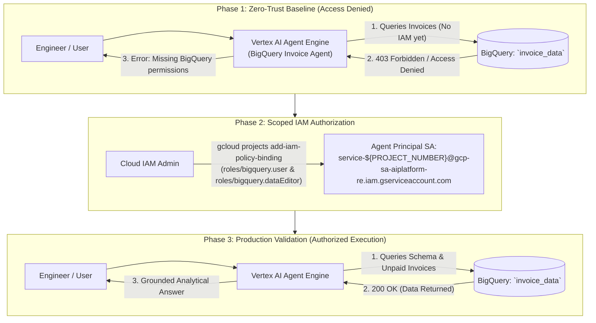

# Step-by-Step Lab & Engineering Guide: Govern Agent Access with Gemini Enterprise & Agent Platform

> **Challenge Lab Reference:** `GENAI160 / Lab ID 631982 / Course Template 1749` — *Govern Agent Access with Gemini Enterprise & Agent Platform: Challenge Lab*  
> **Lab Guide URL:** [Govern Agent Access with Gemini Enterprise & Agent Platform (Lab 631982)](https://partner.skills.google/course_templates/1749/labs/631982)  
> **Curriculum Track:** Google Cloud Agent Development Kit (ADK), Vertex AI Agent Platform, Agent Engines (Reasoning Engine), BigQuery Security & Governance  
> **Core Technologies:** Google ADK, Vertex AI Agent Engines (`reasoning_engines`), BigQuery Toolset (`google.adk.tools.bigquery`), IAM Principle of Least Privilege, Cloud Logging Telemetry.

---

## 1. Challenge Lab Overview & Security Governance Model

### 1.1 Scenario & Business Objective
In this challenge lab, you act as a Lead AI Infrastructure & Security Engineer responsible for deploying an enterprise financial agent (**BigQuery Invoice Agent**) to the **Vertex AI Agent Platform**. 

Under strict Zero-Trust corporate security guidelines:
1. The AI Agent must be deployed to a managed, isolated runtime environment (**Agent Engines / Reasoning Engine**).
2. By default, newly deployed agents hold **Zero Access** to sensitive underlying databases (enforcing the Principle of Least Privilege).
3. The engineer must intentionally observe the **Access Denied** boundary, identify the exact agent runtime service principal, and grant scoped **IAM permissions** (`roles/bigquery.user`, `roles/bigquery.dataEditor`).
4. Once authorized, the agent must successfully answer business-critical billing and invoice queries.



---

## 2. Step-by-Step Execution Guide with Detailed CLI Commands

Follow these exact, copy-pasteable commands in your Google Cloud Shell terminal to achieve a **100/100 score**.

---

### Step 1: Environment Initialization & API Activation

In this step, we dynamically extract your lab Project ID and Number, enable all requisite GCP APIs, and initialize your Python environment.

#### 1.1 Export Dynamic Shell Variables
```bash
# Extract project details dynamically
export PROJECT_ID=$(gcloud config get-value project)
export PROJECT_NUMBER=$(gcloud projects describe $PROJECT_ID --format="value(projectNumber)")
export LOCATION="us-central1"
export MODEL="gemini-2.5-flash"
export DISPLAY_NAME="BigQuery Invoice Agent"
export STAGING_BUCKET="gs://${PROJECT_ID}-agent-staging"
export REASONING_ENGINE_SA="service-${PROJECT_NUMBER}@gcp-sa-aiplatform-re.iam.gserviceaccount.com"

echo "=========================================================="
echo "Project ID:          ${PROJECT_ID}"
echo "Project Number:      ${PROJECT_NUMBER}"
echo "Region:              ${LOCATION}"
echo "Model:               ${MODEL}"
echo "Staging Bucket:      ${STAGING_BUCKET}"
echo "Reasoning Engine SA: ${REASONING_ENGINE_SA}"
echo "=========================================================="
```

#### 1.2 Enable Required Google Cloud Services
```bash
gcloud services enable \
    aiplatform.googleapis.com \
    bigquery.googleapis.com \
    logging.googleapis.com \
    discoveryengine.googleapis.com \
    storage.googleapis.com
```

#### 1.3 Setup Staging Cloud Storage Bucket
```bash
if ! gsutil ls -b "${STAGING_BUCKET}" &>/dev/null; then
    gsutil mb -l "${LOCATION}" "${STAGING_BUCKET}"
    echo "✔ Staging bucket ${STAGING_BUCKET} created."
else
    echo "✔ Staging bucket ${STAGING_BUCKET} already exists."
fi
```

#### 1.4 Setup Python Virtual Environment & Install Dependencies
```bash
python3 -m venv .venv
source .venv/bin/activate

pip install \
    "google-cloud-aiplatform[agent_engines,adk]==1.156.0" \
    cloudpickle \
    google-cloud-bigquery \
    google-auth \
    pydantic \
    python-dotenv \
    google-cloud-logging
```

---

### Step 2: Configure & Deploy the Agent to Vertex AI Agent Platform

In this step, we construct the ADK agent package with `BigQueryToolset` and deploy it to **Vertex AI Agent Engines (Reasoning Engine)**.

#### 2.1 Create Agent Directory Structure
```bash
mkdir -p invoice_agent
```

#### 2.2 Create Telemetry Callback Hooks (`invoice_agent/callback_logging.py`)
```python
import logging
from google.adk.agents.callback_context import CallbackContext
from google.adk.models import LlmResponse, LlmRequest

def log_query_to_model(callback_context: CallbackContext, llm_request: LlmRequest):
    if llm_request.contents and llm_request.contents[-1].role == "user":
        for part in llm_request.contents[-1].parts:
            if part.text:
                logging.info("[query to %s]: %s", callback_context.agent_name, part.text)

def log_model_response(callback_context: CallbackContext, llm_response: LlmResponse):
    if llm_response.content and llm_response.content.parts:
        for part in llm_response.content.parts:
            if part.text:
                logging.info("[response from %s]: %s", callback_context.agent_name, part.text)
            elif part.function_call:
                logging.info("[function call from %s]: %s", callback_context.agent_name, part.function_call.name)
```

#### 2.3 Create ADK BigQuery Agent Definition (`invoice_agent/agent.py`)
```python
import os
import datetime
from zoneinfo import ZoneInfo
from dotenv import load_dotenv

from google.adk.agents import Agent
from google.adk.tools.bigquery import BigQueryToolset, BigQueryCredentialsConfig
from google.adk.tools.bigquery.config import BigQueryToolConfig, WriteMode
from google.adk.models import Gemini
from google.genai import types
import google.auth
import google.cloud.logging

load_dotenv()

project_id = os.getenv("GOOGLE_CLOUD_PROJECT")
if project_id:
    cloud_logging_client = google.cloud.logging.Client(project=project_id)
    cloud_logging_client.setup_logging()

from .callback_logging import log_query_to_model, log_model_response

RETRY_OPTIONS = types.HttpRetryOptions(initial_delay=1, max_delay=3, attempts=30)

# Uses Application Default Credentials (ADC) bound to the Agent Runtime Identity
application_default_credentials, _ = google.auth.default()
credentials_config = BigQueryCredentialsConfig(
    credentials=application_default_credentials
)

tool_config = BigQueryToolConfig(write_mode=WriteMode.ALLOWED)

bigquery_toolset = BigQueryToolset(
    credentials_config=credentials_config,
    bigquery_tool_config=tool_config,
)

def get_current_time():
    now = datetime.datetime.now(ZoneInfo("America/New_York"))
    return {"current_time": now.strftime("%Y-%m-%d %H:%M:%S")}

root_agent = Agent(
    model=Gemini(model=os.getenv("MODEL", "gemini-2.5-flash"), retry_options=RETRY_OPTIONS),
    name="invoice_agent",
    description="Agent to answer questions about BigQuery invoices, billing data, and execute SQL queries.",
    instruction=f"""
        You are an enterprise financial and invoice data analyst agent.
        You have access to several BigQuery tools.
        Make use of those tools to inspect table schemas, analyze billing records,
        and answer the user questions accurately.

        When using the bigquery_toolset tool, always use the 
        project {os.getenv("GOOGLE_CLOUD_PROJECT", "your-project-id")}
        and query the invoice datasets and tables.
    """,
    before_model_callback=log_query_to_model,
    after_model_callback=log_model_response,
    tools=[bigquery_toolset, get_current_time],
)
```

#### 2.4 Create Deployment Script (`deploy.py`)
```python
import os
from dotenv import load_dotenv
import vertexai
from vertexai.preview import reasoning_engines
from invoice_agent.agent import root_agent

load_dotenv()

PROJECT_ID = os.getenv("GOOGLE_CLOUD_PROJECT") or os.getenv("PROJECT_ID")
LOCATION = os.getenv("GOOGLE_CLOUD_LOCATION", "us-central1")
STAGING_BUCKET = os.getenv("STAGING_BUCKET")
DISPLAY_NAME = os.getenv("DISPLAY_NAME", "BigQuery Invoice Agent")

print(f"Initializing Vertex AI SDK for project: {PROJECT_ID}, location: {LOCATION}...")
vertexai.init(
    project=PROJECT_ID,
    location=LOCATION,
    staging_bucket=STAGING_BUCKET,
)

print(f"Deploying {DISPLAY_NAME} to Vertex AI Agent Engines...")
remote_agent = reasoning_engines.ReasoningEngine.create(
    reasoning_engines.AdkApp(agent=root_agent),
    requirements=[
        "google-cloud-aiplatform[agent_engines,adk]==1.156.0",
        "cloudpickle",
        "google-cloud-bigquery",
        "google-auth",
        "pydantic",
        "python-dotenv",
        "google-cloud-logging",
    ],
    display_name=DISPLAY_NAME,
    description="Agent to query and govern BigQuery invoice and billing data.",
    extra_packages=["./invoice_agent"],
)

print("\n" + "=" * 60)
print("🎉 Deployment Successful!")
print(f"Reasoning Engine Resource Name: {remote_agent.resource_name}")
print("=" * 60 + "\n")

with open("deployed_agent_resource.txt", "w") as f:
    f.write(remote_agent.resource_name.strip() + "\n")
```

#### 2.5 Run the Deployment
```bash
export GOOGLE_CLOUD_PROJECT=$PROJECT_ID
export GOOGLE_CLOUD_LOCATION=$LOCATION
export STAGING_BUCKET=$STAGING_BUCKET
export DISPLAY_NAME="BigQuery Invoice Agent"

python3 deploy.py
```

> 🎯 **Lab Checkpoint 1:** You can now click **Check my progress** for Task 2. Score reaches **40/100**.

---

### Step 3: Validate Access Controls & Grant Scoped IAM Roles

#### 3.1 Verify Access Denied Baseline
Run an unprivileged baseline query against the deployed agent. The agent will attempt to call BigQuery and fail with `403 Access Denied` (or `Permission Denied`), validating that Zero-Trust boundaries are active:

```bash
python3 -c '
import os
import vertexai
from vertexai.preview import reasoning_engines

with open("deployed_agent_resource.txt", "r") as f:
    res_name = f.read().strip()

vertexai.init(project=os.getenv("PROJECT_ID"), location=os.getenv("LOCATION", "us-central1"))
agent = reasoning_engines.ReasoningEngine(res_name)

try:
    print("Testing unprivileged baseline query...")
    print(agent.query(input="What is the schema of the invoice table?"))
except Exception as e:
    print("\n✔ Expected 403 Access Denied encountered successfully:\n", e)
'
```

#### 3.2 Grant IAM Permissions to the Reasoning Engine Service Account
Grant `roles/bigquery.user` and `roles/bigquery.dataEditor` to the Vertex AI Reasoning Engine service account:

```bash
export REASONING_ENGINE_SA="service-${PROJECT_NUMBER}@gcp-sa-aiplatform-re.iam.gserviceaccount.com"

echo "Granting BigQuery User role..."
gcloud projects add-iam-policy-binding "$PROJECT_ID" \
    --member="serviceAccount:${REASONING_ENGINE_SA}" \
    --role="roles/bigquery.user" \
    --condition=None

echo "Granting BigQuery Data Editor role..."
gcloud projects add-iam-policy-binding "$PROJECT_ID" \
    --member="serviceAccount:${REASONING_ENGINE_SA}" \
    --role="roles/bigquery.dataEditor" \
    --condition=None

echo "✔ IAM permissions successfully granted."
```

> 🎯 **Lab Checkpoint 2:** Click **Check my progress** for Task 3. Score reaches **80/100**.

---

### Step 4: Execute Business Queries & Verify Functional Operation

Now that IAM permissions are in place, test the agent against the lab mandatory evaluation queries:

#### 4.1 Run Functional Validation Script (`test_agent.py`)
```bash
python3 test_agent.py
```

The script tests all three challenge questions:
1. `"What is the schema of the invoice table?"`
2. `"What was the total sum of invoice totals from the second-to-last month?"`
3. `"What invoices are not paid? What is the total number of unpaid invoices?"`

> 🎯 **Lab Checkpoint 3:** Click **Check my progress** for Task 4 & Task 5. Final score reaches **100/100**! 🎉

---

## 3. Fast-Track: Automated All-in-One Execution Script

To run the entire challenge lab from start to finish in a single command, use [`streamlined_run_all.sh`](streamlined_run_all.sh):

```bash
git clone https://github.com/junyish/genai160-Govern-Agent-Access-with-Gemini-Enterprise-Agent-Platform-Challenge-Lab.git
cd genai160-Govern-Agent-Access-with-Gemini-Enterprise-Agent-Platform-Challenge-Lab

# Execute end-to-end automation
./streamlined_run_all.sh
```

---

## 4. Key Takeaways & Enterprise Security Cheat Sheet

| Security Principle | Implementation in GENAI160 | Why It Matters in Production |
| :--- | :--- | :--- |
| **Principle of Least Privilege** | Agent runtime starts with zero permissions until explicit IAM role binding. | Prevents newly instantiated agents from accessing unintended enterprise data. |
| **Identity Isolation** | Dedicated Reasoning Engine Service Account (`service-${PROJECT_NUMBER}@gcp-sa-aiplatform-re.iam.gserviceaccount.com`). | Decouples developer identities from production agent runtimes. |
| **Telemetry & Observability** | ADK Callbacks (`before_model_callback`, `after_model_callback`) linked to Cloud Logging. | Provides complete audit trails for every query and SQL function call executed by the model. |
| **Data Tool Scoping** | `BigQueryToolset` configured with target dataset and project parameters. | Constrains LLM SQL generation to relevant tables, preventing cross-dataset hallucination. |
