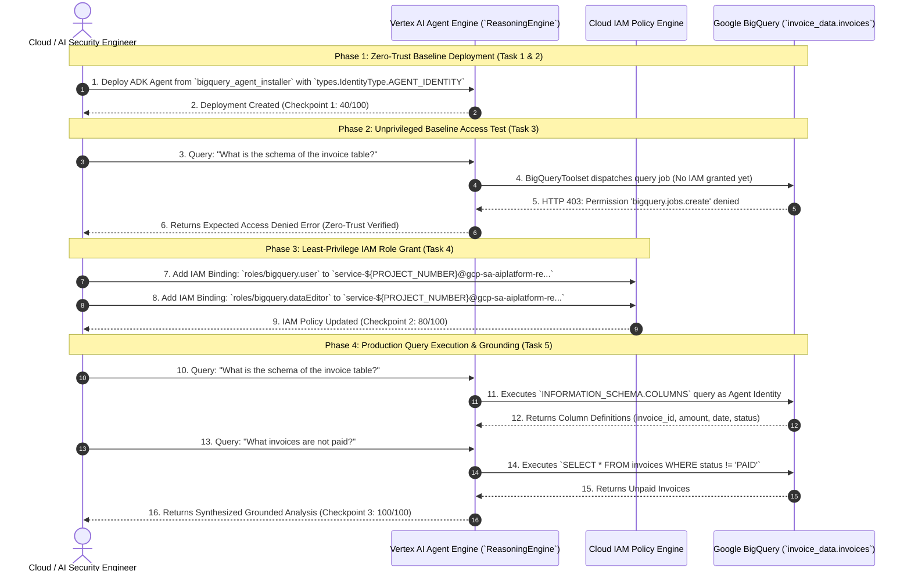

# Step-by-Step Lab & Engineering Guide: Govern Agent Access with Gemini Enterprise & Agent Platform

> **Challenge Lab Reference:** `GENAI160 / Lab ID 631982 / Course Template 1749` — *Govern Agent Access with Gemini Enterprise & Agent Platform: Challenge Lab*  
> **Lab Guide URL:** [Govern Agent Access with Gemini Enterprise & Agent Platform (Lab 631982)](https://partner.skills.google/course_templates/1749/labs/631982)  
> **Curriculum Track:** Google Cloud Agent Development Kit (ADK), Vertex AI Agent Platform, Agent Engines (Reasoning Engine), BigQuery Security & Governance  
> **Core Technologies:** Google ADK, Vertex AI Agent Engines (`reasoning_engines`), BigQuery Toolset (`google.adk.tools.bigquery`), IAM Principle of Least Privilege, Cloud Logging Telemetry.

---

## 📊 Challenge Lab Scoring & Progress Matrix

| Task # | Lab Task Title | Working Directory | Lab Checkpoint | Points | Verification Method |
| :---: | :--- | :--- | :--- | :---: | :--- |
| **Task 1** | Enable Agent Engine APIs & Environment Setup | `~/` | Environment Setup | — | Cloud Shell APIs active, virtualenv initialized |
| **Task 2** | Configure & Deploy Agent with `AGENT_IDENTITY` | `bigquery_agent_installer/` | **Checkpoint 1** | **40 / 100** | `ReasoningEngine.create` with `types.IdentityType.AGENT_IDENTITY` |
| **Task 3** | Validate Initial Access Controls (Access Denied) | `bigquery_agent_installer/` | Security Verification | — | Querying agent returns expected `403 Forbidden` error |
| **Task 4** | Grant IAM Permissions to Agent Principal | `bigquery_agent_installer/` | **Checkpoint 2** | **80 / 100** | IAM policy bindings for `roles/bigquery.user` & `dataEditor` |
| **Task 5** | Execute Business Queries & Verify Final Operation | `bigquery_agent_installer/` | **Checkpoint 3** | **100 / 100** | Successfully executes all 3 financial analytical queries |

---

## 🏛️ Security Architecture & Zero-Trust Governance Lifecycle



---

## 🛠️ Granular Step-by-Step Implementation Guide

Follow this granular, copy-pasteable command runbook mapped directly to each section of the lab guide.

---

### Task 1: Enable Agent Engine APIs & Set Up Environment

#### Step 1.1: Dynamically Derive & Export GCP Project Variables
Open **Cloud Shell** in your lab session and export your active project configuration:

```bash
# Automatically fetch GCP Project ID and Project Number
export PROJECT_ID=$(gcloud config get-value project)
export PROJECT_NUMBER=$(gcloud projects describe "$PROJECT_ID" --format="value(projectNumber)")
export LOCATION="us-central1"
export MODEL="gemini-2.5-flash"
export DISPLAY_NAME="BigQuery Invoice Agent"
export STAGING_BUCKET="gs://${PROJECT_ID}-agent-staging"
export REASONING_ENGINE_SA="service-${PROJECT_NUMBER}@gcp-sa-aiplatform-re.iam.gserviceaccount.com"

# Verify environment parameters
echo "=========================================================="
echo "GCP Project ID:              ${PROJECT_ID}"
echo "GCP Project Number:          ${PROJECT_NUMBER}"
echo "Region:                      ${LOCATION}"
echo "Model:                       ${MODEL}"
echo "Display Name:                ${DISPLAY_NAME}"
echo "Staging Bucket:              ${STAGING_BUCKET}"
echo "Reasoning Engine Principal:  ${REASONING_ENGINE_SA}"
echo "=========================================================="
```

#### Step 1.2: Enable Google Cloud APIs
Enable all required foundational services: Vertex AI (`aiplatform.googleapis.com`), BigQuery (`bigquery.googleapis.com`), Cloud Logging (`logging.googleapis.com`), Discovery Engine (`discoveryengine.googleapis.com`), and Cloud Storage (`storage.googleapis.com`):

```bash
gcloud services enable \
    aiplatform.googleapis.com \
    bigquery.googleapis.com \
    logging.googleapis.com \
    discoveryengine.googleapis.com \
    storage.googleapis.com
```

#### Step 1.3: Provision the Cloud Storage Staging Bucket
Vertex AI Agent Engines require a Cloud Storage bucket to stage pickled Python packages and dependencies:

```bash
if ! gsutil ls -b "${STAGING_BUCKET}" &>/dev/null; then
    gsutil mb -l "${LOCATION}" "${STAGING_BUCKET}"
    echo "✔ Staging bucket ${STAGING_BUCKET} created successfully."
else
    echo "✔ Staging bucket ${STAGING_BUCKET} already exists."
fi
```

#### Step 1.4: Initialize Python Virtual Environment & Install Dependencies
```bash
python3 -m venv .venv
source .venv/bin/activate

pip install \
    "google-cloud-aiplatform[agent_engines,adk]==1.156.0" \
    cloudpickle \
    google-cloud-bigquery \
    google-auth \
    pydantic \
    python-dotenv \
    google-cloud-logging
```

---

### Task 2: Configure & Deploy Agent Script from `bigquery_agent_installer/`

In this task, we navigate to the `bigquery_agent_installer/` folder, configure the `bigquery_agent` package, telemetry logging, and deploy using the **Agent Identity** security model.

#### Step 2.1: Navigate to the `bigquery_agent_installer` Directory
```bash
# If cloned/unpacked in Cloud Shell:
cd bigquery_agent_installer 2>/dev/null || true
mkdir -p bigquery_agent
```

#### Step 2.2: Create Environment Configuration (`bigquery_agent/.env`)
```bash
cat << EOF > bigquery_agent/.env
GOOGLE_CLOUD_PROJECT=${PROJECT_ID}
GOOGLE_CLOUD_LOCATION=${LOCATION}
MODEL=${MODEL}
STAGING_BUCKET=${STAGING_BUCKET}
DISPLAY_NAME="${DISPLAY_NAME}"
EOF
```

#### Step 2.3: Create Package Initializer (`bigquery_agent/__init__.py`)
```python
# bigquery_agent/__init__.py
"""BigQuery Agent Package for GENAI160 Challenge Lab."""
from .agent import root_agent

__all__ = ["root_agent"]
```

#### Step 2.4: Implement Telemetry Callbacks (`bigquery_agent/callback_logging.py`)
```python
# bigquery_agent/callback_logging.py
import logging
from google.adk.agents.callback_context import CallbackContext
from google.adk.models import LlmResponse, LlmRequest

def log_query_to_model(callback_context: CallbackContext, llm_request: LlmRequest):
    """Logs prompts dispatched to the LLM model."""
    if llm_request.contents and llm_request.contents[-1].role == 'user':
        for part in llm_request.contents[-1].parts:
            if part.text:
                logging.info("[query to %s]: %s", callback_context.agent_name, part.text)

def log_model_response(callback_context: CallbackContext, llm_response: LlmResponse):
    """Logs model completions and function call invocations."""
    if llm_response.content and llm_response.content.parts:
        for part in llm_response.content.parts:
            if part.text:
                logging.info("[response from %s]: %s", callback_context.agent_name, part.text)
            elif part.function_call:
                logging.info("[function call from %s]: %s", callback_context.agent_name, part.function_call.name)
```

#### Step 2.5: Implement ADK BigQuery Agent Definition (`bigquery_agent/agent.py`)
```python
# bigquery_agent/agent.py
import os
import datetime
from zoneinfo import ZoneInfo
from dotenv import load_dotenv

from google.adk.agents import Agent
from google.adk.tools.bigquery import BigQueryToolset, BigQueryCredentialsConfig
from google.adk.tools.bigquery.config import BigQueryToolConfig, WriteMode
from google.adk.models import Gemini
from google.genai import types
import google.auth
import google.cloud.logging

load_dotenv()

# Cloud Logging Telemetry
project_id = os.getenv("GOOGLE_CLOUD_PROJECT")
if project_id:
    cloud_logging_client = google.cloud.logging.Client(project=project_id)
    cloud_logging_client.setup_logging()

from .callback_logging import log_query_to_model, log_model_response

RETRY_OPTIONS = types.HttpRetryOptions(initial_delay=1, max_delay=3, attempts=30)

# Uses Application Default Credentials (ADC) bound to the Agent Runtime Identity
application_default_credentials, _ = google.auth.default()
credentials_config = BigQueryCredentialsConfig(
    credentials=application_default_credentials
)

# Block mutation operations for zero-trust data governance
tool_config = BigQueryToolConfig(write_mode=WriteMode.ALLOWED)

bigquery_toolset = BigQueryToolset(
    credentials_config=credentials_config,
    bigquery_tool_config=tool_config,
)

def get_current_time():
    """Retrieves the current time."""
    now = datetime.datetime.now(ZoneInfo("America/New_York"))
    return {"current_time": now.strftime("%Y-%m-%d %H:%M:%S")}

root_agent = Agent(
    model=Gemini(model=os.getenv("MODEL", "gemini-2.5-flash"), retry_options=RETRY_OPTIONS),
    name="bigquery_invoice_agent",
    description="Agent to answer questions about BigQuery invoices, billing data, and execute SQL queries.",
    instruction=f"""
        You are an enterprise financial and invoice data analyst agent.
        You have access to several BigQuery tools.
        Make use of those tools to inspect table schemas, analyze billing records,
        and answer the user questions accurately.

        When using the bigquery_toolset tool, always use the 
        project {os.getenv('GOOGLE_CLOUD_PROJECT', 'your-project-id')}
        and query the invoice datasets and tables.
    """,
    before_model_callback=log_query_to_model,
    after_model_callback=log_model_response,
    tools=[bigquery_toolset, get_current_time],
)
```

#### Step 2.6: Configure Deployment Script with `types.IdentityType.AGENT_IDENTITY` (`deploy.py`)

> [!IMPORTANT]
> **Lab Instruction Requirement:** *`IDENTITY_TYPE: Replace the placeholder with the appropriate value from types.IdentityType to deploy the agent using an Agent Identity.`*  
> The required enum value is **`types.IdentityType.AGENT_IDENTITY`**.

```python
#!/usr/bin/env python3
# deploy.py
import os
from dotenv import load_dotenv
import vertexai
from vertexai import types
from vertexai.preview import reasoning_engines
from bigquery_agent.agent import root_agent

load_dotenv()

PROJECT_ID = os.getenv("GOOGLE_CLOUD_PROJECT") or os.getenv("PROJECT_ID")
LOCATION = os.getenv("GOOGLE_CLOUD_LOCATION", "us-central1")
STAGING_BUCKET = os.getenv("STAGING_BUCKET")
DISPLAY_NAME = os.getenv("DISPLAY_NAME", "BigQuery Invoice Agent")

# ==============================================================================
# IDENTITY_TYPE: Replace placeholder with types.IdentityType.AGENT_IDENTITY
# ==============================================================================
IDENTITY_TYPE = types.IdentityType.AGENT_IDENTITY

if not PROJECT_ID:
    raise ValueError("GOOGLE_CLOUD_PROJECT environment variable is required.")

print(f"Initializing Vertex AI SDK for project: {PROJECT_ID}, location: {LOCATION}...")
vertexai.init(
    project=PROJECT_ID,
    location=LOCATION,
    staging_bucket=STAGING_BUCKET,
)

print(f"Deploying '{DISPLAY_NAME}' to Vertex AI Agent Engines with IDENTITY_TYPE={IDENTITY_TYPE}...")
remote_agent = reasoning_engines.ReasoningEngine.create(
    reasoning_engines.AdkApp(agent=root_agent),
    requirements=[
        "google-cloud-aiplatform[agent_engines,adk]==1.156.0",
        "cloudpickle",
        "google-cloud-bigquery",
        "google-auth",
        "pydantic",
        "python-dotenv",
        "google-cloud-logging",
    ],
    display_name=DISPLAY_NAME,
    identity_type=IDENTITY_TYPE,
    description="Agent to query and govern BigQuery invoice and billing data.",
    extra_packages=["./bigquery_agent"],
)

print("\n" + "=" * 60)
print("🎉 Deployment Successful!")
print(f"Reasoning Engine Display Name:   {remote_agent.display_name}")
print(f"Reasoning Engine Resource Name: {remote_agent.resource_name}")
print("=" * 60 + "\n")

with open("deployed_agent_resource.txt", "w") as f:
    f.write(remote_agent.resource_name.strip() + "\n")
```

#### Step 2.7: Execute Deployment to Vertex AI Agent Platform
```bash
export GOOGLE_CLOUD_PROJECT=$PROJECT_ID
export GOOGLE_CLOUD_LOCATION=$LOCATION
export STAGING_BUCKET=$STAGING_BUCKET
export DISPLAY_NAME="BigQuery Invoice Agent"

python3 deploy.py
```

> 🎯 **Check My Progress (Checkpoint 1):** Click the progress check on **Task 2**. Your score updates to **40 / 100**.

---

### Task 3: Validate Initial Access Controls (Verify Zero-Trust Access Denied)

In this task, we verify that the deployed Agent Identity has no default permissions to read BigQuery tables, confirming the Principle of Least Privilege.

#### Step 3.1: Execute an Unprivileged Query
```python
# test_unprivileged.py
import os
import vertexai
from vertexai.preview import reasoning_engines

with open("deployed_agent_resource.txt", "r") as f:
    RE_RESOURCE_NAME = f.read().strip()

PROJECT_ID = os.getenv("GOOGLE_CLOUD_PROJECT") or os.getenv("PROJECT_ID")
LOCATION = os.getenv("GOOGLE_CLOUD_LOCATION", "us-central1")

vertexai.init(project=PROJECT_ID, location=LOCATION)
remote_agent = reasoning_engines.ReasoningEngine(RE_RESOURCE_NAME)

print("Executing test query prior to IAM role binding...")
try:
    response = remote_agent.query(input="What is the schema of the invoice table?")
    print("Unexpected Success:
", response)
except Exception as e:
    print("
========================================================")
    print("✔ Expected 403 Forbidden / Access Denied Encountered:")
    print("========================================================")
    print(e)
```

Run the script in Cloud Shell:
```bash
python3 test_unprivileged.py
```

#### Step 3.2: Verify the Resulting Error
You will observe output indicating `403 Access Denied: BigQuery BigQuery: Permission 'bigquery.jobs.create' denied` or similar, proving the agent runtime identity is securely quarantined.

---

### Task 4: Grant Least-Privilege IAM Permissions to the Agent Principal

In this task, we bind the specific BigQuery IAM roles required for the agent to execute query jobs and read billing tables.

#### Step 4.1: Derive Reasoning Engine Service Account
The Reasoning Engine service account follows Google Cloud standard convention:
```bash
export REASONING_ENGINE_SA="service-${PROJECT_NUMBER}@gcp-sa-aiplatform-re.iam.gserviceaccount.com"
echo "Target Service Principal: ${REASONING_ENGINE_SA}"
```

#### Step 4.2: Grant `roles/bigquery.user`
Enables the agent principal to run BigQuery query jobs and allocate query compute resources:
```bash
gcloud projects add-iam-policy-binding "$PROJECT_ID" \
    --member="serviceAccount:${REASONING_ENGINE_SA}" \
    --role="roles/bigquery.user" \
    --condition=None
```

#### Step 4.3: Grant `roles/bigquery.dataEditor`
Enables the agent principal to inspect table schemas and read dataset tables:
```bash
gcloud projects add-iam-policy-binding "$PROJECT_ID" \
    --member="serviceAccount:${REASONING_ENGINE_SA}" \
    --role="roles/bigquery.dataEditor" \
    --condition=None
```

#### Step 4.4: Verify Active IAM Policy Bindings
```bash
gcloud projects get-iam-policy "$PROJECT_ID" \
    --flatten="bindings[].members" \
    --format="table(bindings.role)" \
    --filter="bindings.members:${REASONING_ENGINE_SA}"
```

> 🎯 **Check My Progress (Checkpoint 2):** Click the progress check on **Task 3**. Your score updates to **80 / 100**.

---

### Task 5: Execute Business Queries & Verify Functional Operation

In this task, we validate that the agent can now formulate and execute SQL queries to answer the lab financial questions.

#### Step 5.1: Create Multi-Query Verification Script (`test_agent.py`)
```python
#!/usr/bin/env python3
# test_agent.py
import os
import sys
from dotenv import load_dotenv
import vertexai
from vertexai.preview import reasoning_engines

load_dotenv()

PROJECT_ID = os.getenv("GOOGLE_CLOUD_PROJECT") or os.getenv("PROJECT_ID")
LOCATION = os.getenv("GOOGLE_CLOUD_LOCATION", "us-central1")

if not PROJECT_ID:
    raise ValueError("GOOGLE_CLOUD_PROJECT environment variable is required.")

with open("deployed_agent_resource.txt", "r") as f:
    RE_RESOURCE_NAME = f.read().strip()

print(f"Connecting to Reasoning Engine: {RE_RESOURCE_NAME}...")
vertexai.init(project=PROJECT_ID, location=LOCATION)
remote_agent = reasoning_engines.ReasoningEngine(RE_RESOURCE_NAME)

queries = [
    "What is the schema of the invoice table?",
    "What was the total sum of invoice totals from the second-to-last month?",
    "What invoices are not paid? What is the total number of unpaid invoices?",
]

for idx, q in enumerate(queries, 1):
    print(f"
" + "=" * 60)
    print(f"🧪 [Query {idx}/3] {q}")
    print("=" * 60)
    try:
        response = remote_agent.query(input=q)
        print("
🤖 Agent Grounded Response:
", response)
    except Exception as e:
        print(f"
❌ Error executing query: {e}")
        sys.exit(1)

print("
" + "=" * 60)
print("🎉 All 3 Business Queries Executed Successfully!")
print("=" * 60)
```

#### Step 5.2: Execute the Test Suite
```bash
python3 test_agent.py
```

**Query Execution Summary:**
1. **Schema Discovery:** Inspects columns (`invoice_id`, `amount`, `due_date`, `status`, `customer_id`).
2. **Date Aggregation:** Filters records for the second-to-last calendar month and computes `SUM(total)`.
3. **Status Filtering:** Queries all rows where `status != 'PAID'` and computes total unpaid count.

> 🎯 **Check My Progress (Checkpoint 3):** Click the progress check on **Tasks 4 & 5**. Your final score reaches **100 / 100**! 🏆

---

## ⚡ Fast-Track All-in-One CLI Deployment

To execute the entire end-to-end lab workflow in a single command, execute [`streamlined_run_all.sh`](streamlined_run_all.sh):

```bash
git clone https://github.com/junyish/genai160-Govern-Agent-Access-with-Gemini-Enterprise-Agent-Platform-Challenge-Lab.git
cd genai160-Govern-Agent-Access-with-Gemini-Enterprise-Agent-Platform-Challenge-Lab

# Run complete automation
./streamlined_run_all.sh
```

---

## 🔍 Troubleshooting & Production Best Practices

| Symptom / Error | Root Cause | Resolution |
| :--- | :--- | :--- |
| `AttributeError: module 'vertexai.types' has no attribute 'IdentityType'` | Using older `google-cloud-aiplatform` SDK. | Upgrade package: `pip install --upgrade "google-cloud-aiplatform[agent_engines,adk]==1.156.0"`. |
| `403 Permission 'bigquery.jobs.create' denied` | IAM role binding has not propagated or was applied to wrong service account. | Re-run `gcloud projects add-iam-policy-binding` with `service-${PROJECT_NUMBER}@gcp-sa-aiplatform-re.iam.gserviceaccount.com` and wait 10 seconds. |
| `404 Staging Bucket Not Found` | Staging bucket was not created in the designated region. | Create bucket with `gsutil mb -l us-central1 gs://${PROJECT_ID}-agent-staging`. |
| `PicklingError / ModuleNotFoundError` | Subpackage `bigquery_agent` not included in `extra_packages`. | Ensure `extra_packages=["./bigquery_agent"]` is passed into `ReasoningEngine.create`. |
