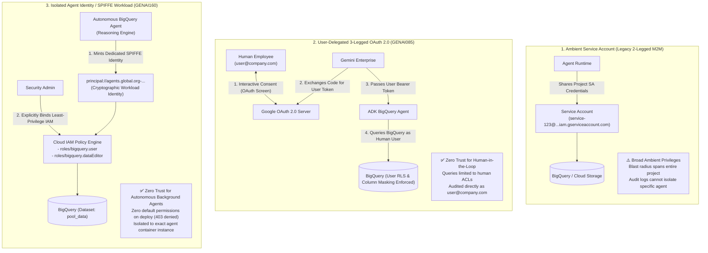
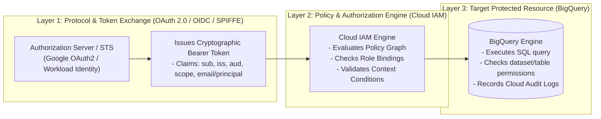
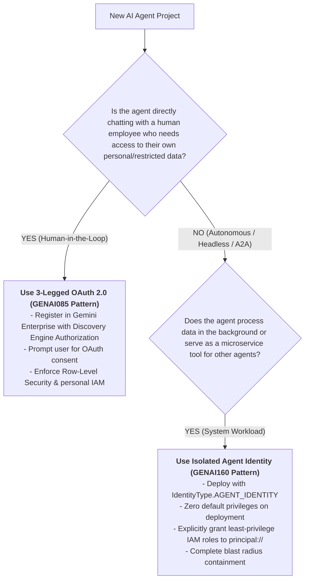

# Deep-Dive Architectural Takeaway: Governing Agent Access, Agent Identity (SPIFFE/IAM), and 2-Legged vs. 3-Legged OAuth

> **Challenge Lab Reference:** `GENAI160 / Lab ID 631982 / Course Template 1749`  
> **Prerequisite Context:** `GENAI085` (*Add an ADK Agent to Gemini Enterprise with 3-Legged OAuth Delegation*)  
> **Target Technologies:** Google Agent Development Kit (ADK), Vertex AI Agent Platform (Agent Engines / Reasoning Engine), Gemini Enterprise, Cloud IAM, SPIFFE / Workload Identity Federation, OAuth 2.0.

---

## 1. Executive Synthesis & The Three Paradigms of AI Agent Access Control

In modern enterprise AI systems, how an agent authenticates to databases, APIs, and cloud resources determines its **security posture, blast radius, auditability, and data isolation**.

Across the Google Cloud GenAI curriculum (`GENAI085` vs `GENAI160`), we observe an evolution across **three distinct access governance paradigms**:



---

## 2. Comprehensive Comparison: GENAI085 (3-Legged OAuth) vs. GENAI160 (Agent Identity & IAM)

| Dimension | `GENAI085` (User-Delegated 3-Legged OAuth) | `GENAI160` (Isolated Agent Identity / SPIFFE IAM) | Legacy Service Account (2-Legged M2M) |
| :--- | :--- | :--- | :--- |
| **Primary Use Case** | Interactive Human-facing assistants inside **Gemini Enterprise** (Employee chats). | **Autonomous background agents**, A2A (Agent-to-Agent) orchestrators, headless pipelines. | Legacy batch daemons, cron scripts, shared microservices. |
| **Identity Owner** | The **Human End-User** logged into the workspace (`user@company.com`). | The **Agent Runtime Instance itself** (`principal://agents.global.org-...`). | A **Shared Cloud Service Account** (`sa@project.iam.gserviceaccount.com`). |
| **Authentication Protocol** | **3-Legged OAuth 2.0 Authorization Code Grant** with interactive user consent modal. | **SPIFFE / Workload Identity Federation** via Application Default Credentials (ADC). | **2-Legged OAuth 2.0 Client Credentials** / Service Account private keys. |
| **Initial Permissions on Deploy** | Inherits whatever GCP/BigQuery permissions the logged-in employee possesses. | **Zero Default Permissions (Deny-by-Default)**. Blocked with `403 Forbidden` until IAM role binding. | Broad ambient permissions attached to the shared service account. |
| **Who Grants Access?** | **The End-User:** Clicks **"Allow / Connect BigQuery"** in the OAuth Consent Screen. | **Cloud Security Admin / IAM Admin:** Runs `gcloud projects add-iam-policy-binding`. | Project Owner / DevOps at initial project provisioning. |
| **Data Boundary Enforcement** | Enforces **Row-Level Security (RLS)**, column masking, and individual user ACLs. | Enforces **IAM Role boundaries** on datasets/tables explicitly granted to the agent principal. | Coarse-grained: Any user or agent using the SA can see all SA-accessible data. |
| **Cloud Audit Log Attribution** | Caller logged as `user@company.com`. | Caller logged as `principal://agents.global.org-...system.id.goog/...`. | Caller logged generically as `service-account@...`. |
| **Token Lifecycle** | Short-lived user access token refreshed via Discovery Engine Authorization resources. | Short-lived federated workload token minted automatically by Vertex AI Agent Platform runtime. | Long-lived or ambient service account token minted by metadata server. |

---

## 3. Demystifying the Core Concepts: Is Cloud IAM "Totally Different" from OAuth?

A common point of confusion is whether **Cloud IAM** and **OAuth 2.0** are completely separate, competing authentication systems.

> [!IMPORTANT]
> **Key Insight:** **Cloud IAM and OAuth 2.0 are not mutually exclusive competitors; they are complementary layers of a multi-tier Identity & Access Management architecture.**
> - **OAuth 2.0 is the PROTOCOL (The "Passport / Authorization Ticket").**
> - **Cloud IAM is the POLICY & ACCESS EVALUATOR (The "Border Control Guard & Policy Graph").**



### 3.1 What OAuth 2.0 Does (The Delegation Protocol)
- **Standardized Token Format:** Defines how access tokens (JWTs) and refresh tokens are requested, issued, and refreshed.
- **Scoping:** Defines *what permissions* the client is requesting (e.g. `https://www.googleapis.com/auth/bigquery`).
- **Delegation:** Defines how an entity (a human or service) delegates authority to an application without sharing master passwords.
- **Two-Legged OAuth (2-Legged):** M2M (Machine-to-Machine) — Application presents credentials directly to Authorization Server -> Gets Token.
- **Three-Legged OAuth (3-Legged):** Human + Client App + Auth Server — User grants consent via browser redirect -> App exchanges auth code for user token.

### 3.2 What Cloud IAM Does (The Access Policy Graph)
- **Role & Resource Hierarchy:** Models permissions (`bigquery.jobs.create`, `bigquery.tables.getData`) bundled into roles (`roles/bigquery.user`, `roles/bigquery.dataEditor`).
- **Policy Enforcement:** When BigQuery receives an API request bearing an OAuth token, BigQuery asks Cloud IAM:
  > *"Does the identity decoded from this token (`principal://agents.global...` or `user@domain.com`) have permission `bigquery.jobs.create` on project `qwiklabs-gcp-...`?"*
- **Policy Bindings:** IAM allows administrators to attach roles to members:
  ```bash
  gcloud projects add-iam-policy-binding [PROJECT]       --member="[PRINCIPAL_STRING]"       --role="[ROLE_NAME]"
  ```

### 3.3 How They Work Together in `GENAI085` vs `GENAI160`

#### In `GENAI085` (3-Legged OAuth Flow):
1. **OAuth 2.0** manages the user authorization flow (Consent Screen -> Auth Code -> User Access Token).
2. Gemini Enterprise injects this User Access Token into the ADK agent tool call.
3. BigQuery receives the request, validates the token, extracts `sub: user@company.com`, and queries **Cloud IAM** to verify what `user@company.com` is permitted to query in BigQuery.

#### In `GENAI160` (Agent Identity Flow):
1. The agent container runs under Vertex AI Agent Engines.
2. The Agent Engine runtime uses **SPIFFE Workload Identity** to mint a cryptographic token identifying `principal://agents.global.org-...`.
3. When `BigQueryToolset` calls BigQuery via Application Default Credentials (ADC), BigQuery extracts this SPIFFE principal from the bearer token.
4. BigQuery queries **Cloud IAM** to verify if that `principal://` identity has been granted `roles/bigquery.user` and `roles/bigquery.dataEditor`.
5. If yes, the SQL query executes; if no, it fails with `403 Access Denied`.

---

## 4. Deep-Dive: The SPIFFE Agent Principal Identifier Anatomy

In `GENAI160`, the agent's identity principal takes the form:

```text
principal://agents.global.org-616463121992.system.id.goog/resources/aiplatform/projects/1057612962708/locations/us-central1/reasoningEngines/1703351868878487552
```

Let us dissect each segment of this identifier:

```
principal://agents.global.org-616463121992.system.id.goog/resources/aiplatform/projects/1057612962708/locations/us-central1/reasoningEngines/1703351868878487552
|________|  |___________________________________________| |____________________________________________________________________________________________|
    |                             |                                                                        |
Scheme Prefix        Workload Identity Federation Domain                               Specific Cloud Resource Sub-Path
               (Global Organization Identity Trust Pool)             (Project Number + Region + Isolated Reasoning Engine Instance ID)
```

1. **`principal://`**: The IAM URI scheme indicating a federated workload identity principal (as opposed to `user:` or `serviceAccount:`).
2. **`agents.global.org-[ORG_ID].system.id.goog`**: The Google-managed Workload Identity Pool for Gemini Enterprise / Vertex AI Agent Platform. It asserts that this token originated from a verified Google Agent Runtime container.
3. **`resources/aiplatform/projects/[PROJECT_NUMBER]/locations/[LOCATION]/reasoningEngines/[ENGINE_ID]`**: The cryptographic sub-resource binding. This guarantees that **ONLY this specific Reasoning Engine deployment instance** can assume this identity. Other agents in the same project or different projects cannot spoof or share this identity!

---

## 5. Security & Engineering Takeaways: How to Design Enterprise Agent Architectures

When designing multi-agent AI solutions for production enterprises, apply the following architectural decision tree:



### Summary of Best Practices:
1. **Never use Shared Ambient Service Accounts for Production Agents:** Shared service accounts violate the Principle of Least Privilege and destroy audit isolation.
2. **Enforce Deny-by-Default (Zero-Trust):** Always verify that an unprivileged agent encounters `403 Forbidden` prior to granting IAM policies.
3. **Granular Role Separation:** In `GENAI160`, separating **BigQuery User** (`roles/bigquery.user` for job submission) from **BigQuery Data Editor** (`roles/bigquery.dataEditor` for dataset read/write) ensures compute allocation and data access can be governed independently.
4. **End-to-End Auditability:** Cloud Audit Logs will explicitly attribute SQL executions to either the human employee (`GENAI085`) or the specific agent container principal (`GENAI160`), satisfying SOC2, HIPAA, and ISO 27001 compliance standards.
